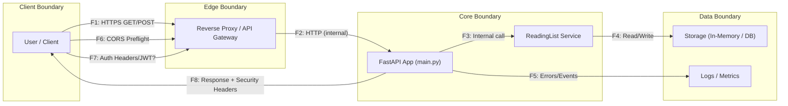

## Контекстная диаграмма (Mermaid)

## Описание модели

Диаграмма отражает потоки данных и границы доверия для сервиса **Reading List API**.

**Уровни и границы доверия:**
- **Client Boundary** — браузер пользователя или фронтенд.
- **Edge Boundary** — обратный прокси или API Gateway, принимает внешние запросы.
- **Core Boundary** — основное приложение FastAPI и сервис управления списками чтения.
- **Data Boundary** — хранилище данных и система логирования/метрик.

**Основные потоки данных (F1–F8):**
| ID | Источник → Приёмник | Канал / Протокол | Описание |
|----|---------------------|------------------|-----------|
| F1 | Клиент → Gateway | HTTPS | Внешний запрос на API |
| F2 | Gateway → FastAPI | HTTP (internal) | Внутренний вызов приложения |
| F3 | FastAPI → Service | Internal call | Обработка бизнес-логики |
| F4 | Service → Storage | Read/Write | Запись/чтение данных |
| F5 | FastAPI → Logs | Internal | Ошибки, события |
| F6 | Клиент → Gateway | HTTPS | CORS preflight |
| F7 | Клиент → Gateway | HTTPS | Аутентификация (JWT Headers) |
| F8 | FastAPI → Клиент | HTTPS | Ответ с безопасными заголовками |
